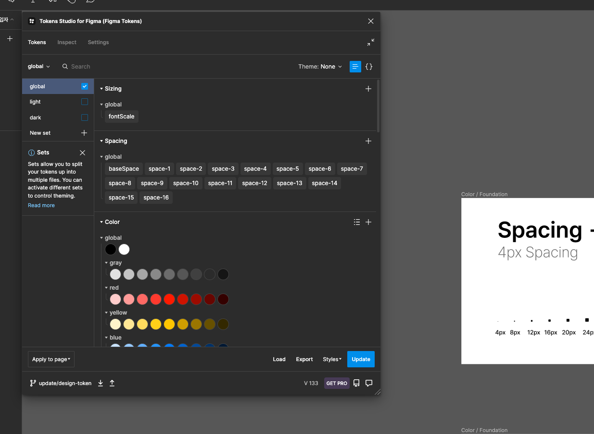
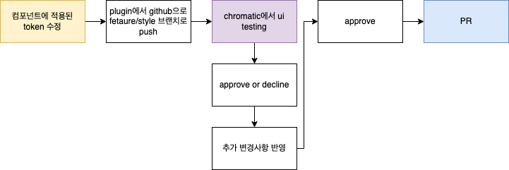

# Design-Development Workflow 개선

## ✨개요

Figma에서 json으로 내보낸 디자인 데이터를 컴포넌트의 스타일 값으로 변환하여 업데이트하는 과정을 자동화 하는 프로젝트.

### 프로세스 개선 목표

C팀은 Figma 프로젝트에서 파운데이션 변경 시 컴포넌트/페이지에 반영되기까지의 과정을 개선하는데에 목표를 두었습니다. 그 과정에서 토큰을 사용가능한 데이터로 변환하고, 실제 컴포넌트에 반영하기까지 어떤 부분이 고려되어야 할 지를 확인했습니다.

## ✨ Tools

### Figma Tokens

Figma Token을 이용해 피그마 디자인 단계에서부터 일관된 시스템을 적용할 수 있습니다.

[피그마 실습 링크](<https://www.figma.com/file/3mXplUlIMMQsyftgmTSVwT/%E2%9D%96-Uber-(Started)-(Copy)?node-id=105%3A1507&t=um01JvZsUPJGCQIY-1>)
Figma token에서 추출된 데이터 `data/tokens.json`에 대한 의존성을 갖게 됩니다.



### Style-Dictionary, Token-transformer

json 데이터를 `css/js` 로 변환합니다. 컴포넌트에서 사용할 수 있도록 옵션을 설정할 수 있습니다.

## 📐WorkFlow


npm배포를 통해 컴포넌트를 다른 레포에서 import할 수 있습니다.

## ✨ getting started

처음 프로젝트 실행 시 아래 패키지를 설치해주세요.

```

$ npm i -g style-dictionary

$ npm i -g token-transformer

```

token을 컴파일 하기 위해서 `yarn compile:token`을 사용합니다.
