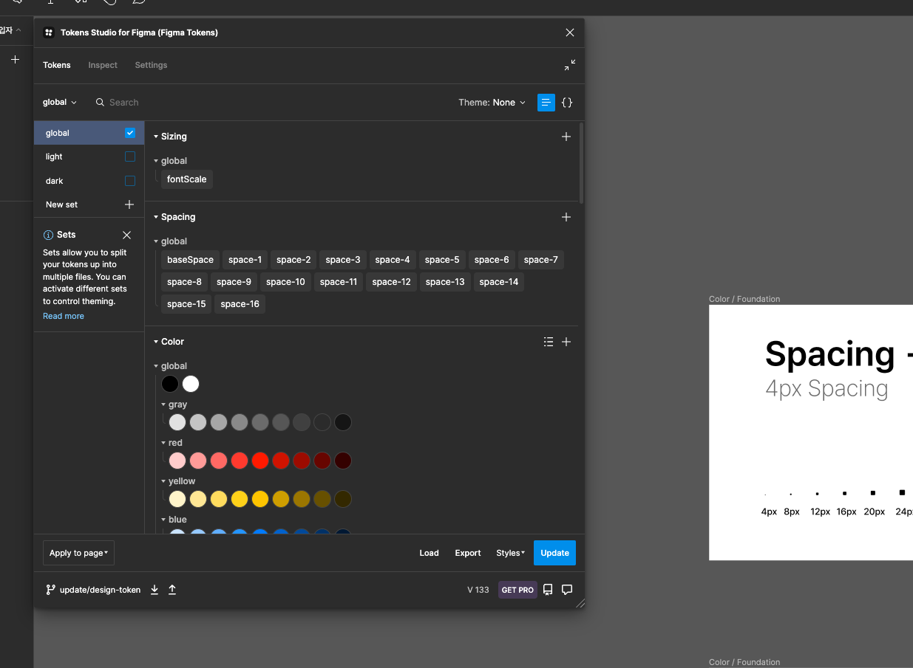

# 컴포넌트 UI 개발

Figma에서 json으로 내보낸 디자인 데이터를 컴포넌트의 스타일 값으로 변환하여 업데이트하는 과정을 자동화 하는 프로젝트.

## 피그마 실습

[피그마 실습 링크](<https://www.figma.com/file/3mXplUlIMMQsyftgmTSVwT/%E2%9D%96-Uber-(Started)-(Copy)?node-id=105%3A1507&t=um01JvZsUPJGCQIY-1>)

피그마 디자인 단계에서부터 토큰으로 일관된 시스템 적용할 수 있습니다.

피그마 토큰 `data/tokens.json`으로 내보내서 같은 의존성 갖게 됩니다.



## 카테고리

### Example

스토리북 기본 컴포넌트

## 개발 환경

### Javascript library

- react (+ typescript)

### Linters

- eslint
- stylelint

### Code formatter

- prettier

### Http client library

- axios

### CSS post-processor

- postcss

### CSS-in-JS

- styled-components

### get started

처음 프로젝트 실행 시 아래 패키지를 설치해주세요.

```
$ npm i -g style-dictionary
$ npm i -g token-transformer
```

token을 컴파일 하기 위해서 `yarn compile:token`을 사용합니다.
